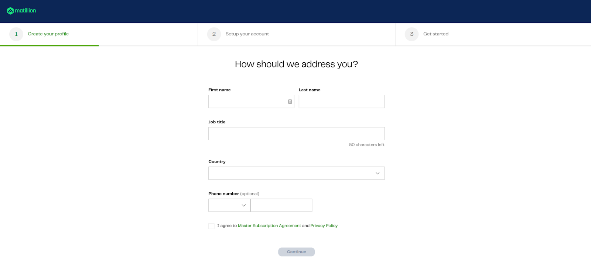
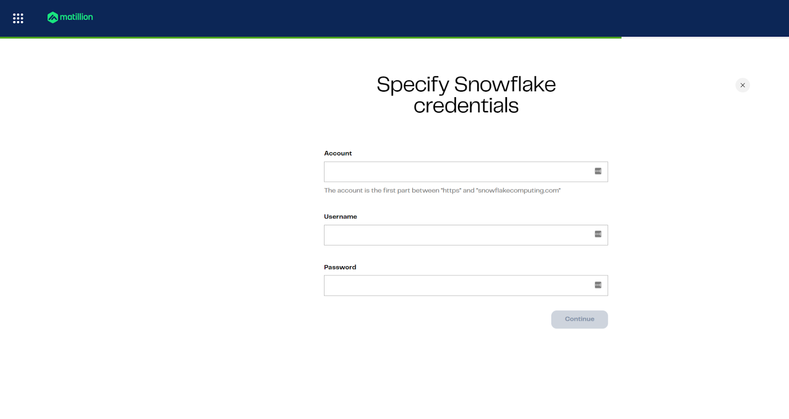
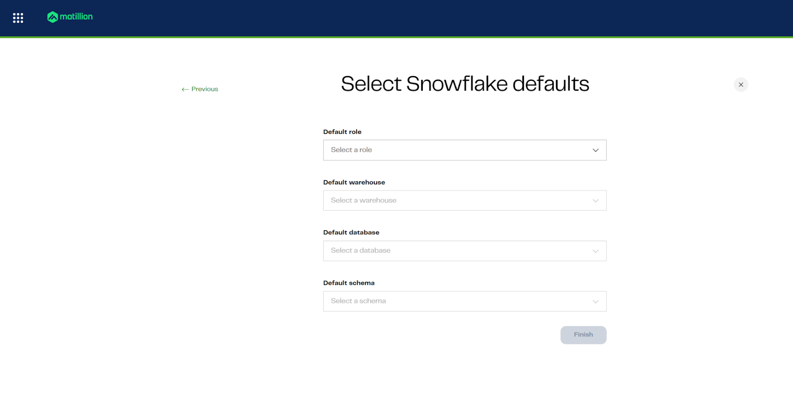

id: matillion-maia-call-center-lab
name: Matillion Maia Call Center Lab
summary: A hands-on lab to learn how to use Matillion Maia for call center analytics and data integration.
author: Douglas Day
categories: ["ETL", "Matillion", "Call Center", "Data Integration"]
environments: Web
duration: 90
status: Published
license: Apache-2.0
tags: ["matillion", "maia", "call-center", "etl", "data-integration"]
source: internal
analytics account: UA-XXXXXXXXX-X
feedback link: https://github.com/datalab-solutions/matillion-codelabs/issues
level: intermediate
products: ["Matillion Maia"]

# Matillion Maia: Call Center AI Agents

## Introduction

In this quickstart, you’ll sign up for Matillion’s Data Productivity Cloud and prepare your environment for call center analytics with Maia. You’ll create an account, choose your region and experience, and (optionally) connect a Snowflake trial warehouse so you can start building pipelines in minutes.

## Configure Snowflake
Duration: 0:04:00

### Learning Outcome
Create the core Snowflake resources needed to run the AI Lab. This includes a database, warehouse, schemas, and a stage for uploading audio and transcript files.

### Download Script
Download the source code for this step [here](https://github.com/datalabsolutions/AI-Labs/blob/main/snowflake-snowflake-intelligence-callcenter-lab/scripts/01-AI-LAB-CONFIGURATION.sql).

### Description
This setup script prepares your Snowflake environment to ingest and process unstructured call center data.

* `CREATE DATABASE` ensures your lab operates in a clean, isolated environment.
* `CREATE WAREHOUSE` provisions compute resources for your queries and is configured to minimize cost via automatic suspend/resume.
* `CREATE SCHEMA` creates logical namespaces for raw files (`RAW`), processed/intermediate data (`STAGE`), and consolidated analytics objects (`ANALYTICS`).
* `CREATE STAGE` sets up a secure location to upload audio and transcript documents (`.mp3`, `.wav`, `.pdf`, `.txt`), supports directory-style access, and uses Snowflake‑managed encryption.

### Step 1: Create the Database
This command creates a database named `CALL_CENTER_DB` if it doesn’t already exist. Using `IF NOT EXISTS` ensures the script is idempotent and safe to rerun.

```sql
CREATE DATABASE IF NOT EXISTS CALL_CENTER_DB;
```

### Step 2: Create a Compute Warehouse

This step provisions a warehouse named `USER_STD_XSMALL_WH` with cost‑efficient settings:

* Size: `XSMALL` — small and cost‑effective for light workloads.
* Type: `STANDARD` — supports most use cases.
* Auto Suspend: `60` seconds — saves credits after inactivity.
* Auto Resume: `TRUE` — resumes automatically on query.
* Initially Suspended: `TRUE` — starts paused until needed.

```sql
CREATE OR REPLACE WAREHOUSE USER_STD_XSMALL_WH
WITH
    WAREHOUSE_SIZE = 'XSMALL'
    WAREHOUSE_TYPE = 'STANDARD'
    AUTO_SUSPEND = 60
    AUTO_RESUME = TRUE
    INITIALLY_SUSPENDED = TRUE;
```

> 💡 **Tip:** Auto-suspend after 60 seconds prevents unnecessary credit usage. Auto-resume ensures queries always run when needed.

### Step 3: Create Required Schemas

Schemas help organize your database objects.

```sql
CREATE SCHEMA IF NOT EXISTS CALL_CENTER_DB.RAW;
CREATE SCHEMA IF NOT EXISTS CALL_CENTER_DB.STAGE;
CREATE SCHEMA IF NOT EXISTS CALL_CENTER_DB.ANALYTICS;
```

* `RAW` stores the ingested audio and transcript files.
* `STAGE` is used for parsed, structured, or AI-enriched data.
* `ANALYTICS` is reserved for semantic views, aggregated results, and reporting tables.

Using `IF NOT EXISTS` prevents duplication errors and makes the script safe to rerun.

### Step 4: Create an Internal Stage for Uploads

The internal stage is where you will upload audio files. 

```sql
CREATE OR REPLACE STAGE CALL_CENTER_DB.RAW.INT_STAGE_DOC_RAW
    DIRECTORY = ( ENABLE = true )
    ENCRYPTION = ( TYPE = 'SNOWFLAKE_SSE' );
```
> 🔒 **Note:** Files uploaded here are secured with Snowflake’s Server-Side Encryption (SSE).

### Step 5: Upload Files to the Stage

Your internal stage `CALL_CENTER_DB.RAW.INT_STAGE_DOC_RAW` is now set up.

1. In Snowsight, go to **Databases**.
2. Select `CALL_CENTER_DB` → `RAW` → **Stages**.
3. Click on `INT_STAGE_DOC_RAW`.
4. Click **+ Files** and upload one or more audio recordings (MP3/WAV).

> 🔒 **Note:** The zip file that you [downloaded](https://github.com/datalabsolutions/AI-Labs/blob/a27daf7c5d6f72949cc73c820351348d755bbd9c/snowflake-snowflake-intelligence-callcenter-lab/assets/audio_files/audio-files.zip?raw=1) will need to be unzipped.  You need to upload the individual files.

---
## Configure Matillion

### Learning Outcomes
In this section, you will learn how to sign up for Matillion’s Data Productivity Cloud and connect Matillion to your Snowflake warehouse. You will also set up the necessary defaults for seamless data integration.

### Prerequisites
Before you begin, ensure you have:
- Access to a Snowflake account with privileges to create databases, warehouses, schemas, and stages. ()

### Description
In this section, you’ll create a Matillion account and configure your environment to work with call center data. You’ll learn how to register, set up your profile, select your region, choose your experience, and connect to your Snowflake warehouse. 

The trial is free and includes 500 usage credits, allowing you to explore Matillion’s features for building and managing ETL pipelines.

### Step 1: Create your account
- Go to [hub.matillion.com/register](https://hub.matillion.com/register)
- Choose a password and verify your email address



### Step 2: Create your profile
- Enter basic details like name, job title, and contact information


### Step 3: Set up your account (Region)
- Select your preferred region. Note: this cannot be changed later


### Step 4: Choose your experience
- Choose "Connect your own cloud data platform"



### Step 5: Specify credentials (if using your own warehouse)
- Provide account, username, and password for your warehouse
- You can add additional environments later



### Step 6: Select warehouse defaults
- Set role, warehouse, database, and schema defaults for pipelines

You’re now ready to begin building pipelines with Matillion’s code-optional interface, pre-built connectors, Git integration, data sampling, and real-time validation.
