id: matillion-maia-call-center-lab
name: Matillion Maia Call Center Lab
summary: A hands-on lab to learn how to use Matillion Maia for call center analytics and data integration.
author: Douglas Day
categories: ["ETL", "Matillion", "Call Center", "Data Integration"]
environments: Web
duration: 90
status: Published
license: Apache-2.0
tags: ["matillion", "maia", "call-center", "etl", "data-integration"]
source: internal
analytics account: UA-XXXXXXXXX-X
feedback link: https://github.com/datalab-solutions/matillion-codelabs/issues
level: intermediate
products: ["Matillion Maia"]

# Matillion Maia: Call Center AI Agents

## Overview

Duration: 0:03:00

### Watch the Lab Overview

For a quick intro into Maia, llick on the image below to watch a short video:

[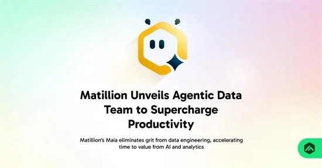](https://www.youtube.com/watch?v=ihIRmJirWno)


### Introduction

In this quickstart, you’ll sign up for Matillion’s Data Productivity Cloud and prepare your environment for call center analytics with Maia. You’ll create an account, choose your region and experience, and connect a Snowflake trial account so you can start building pipelines in minutes.

This hands-on lab demonstrates how to use **Matillion Maia** to transform call center data from raw audio transcripts using Snowflake Cortex AI functions. You’ll learn to ingest, transcribe, enrich, and structure audio recordings (`.mp3`) directly in Snowflake. With functions like `AI_TRANSCRIBE`, `SUMMARIZE`, `SENTIMENT`, `AI_SENTIMENT`, `COMPLETE`, and `EXTRACT_ANSWER`, you’ll unlock actionable insights from unstructured conversations and build advanced analytics pipelines.

* Convert call recordings into searchable transcripts.
* Summarize long conversations into concise overviews.
* Measure overall sentiment.
* Classify call types by intent (complaint, query, sales, cancellation, etc.).
* Extract key answers like agent name.

In addition, you will:

* Deploy a **Cortex Search Service** to perform contextual, vector-based retrieval across transcripts.
* Use **Cortex Analyst** to enable guided, natural language Q&A on call data.

By the end of this lab, you will have transformed **raw call recordings** into **actionable business intelligence**, equipping analysts and support managers with the ability to identify trends, improve service quality, and uncover insights faster.

### What You'll Learn

#### Maia

* Understand the capabilities of Matillion Maia for AI-powered data transformation.
* Learn how Maia integrates with Snowflake to process unstructured call center data.
* Explore Maia's features for orchestrating ETL workflows and leveraging AI functions.
* Discover how Maia simplifies building, scheduling, and monitoring data pipelines.


#### AI SQL

* Upload and manage unstructured call center data in Snowflake
* Transcribe audio with [`AI_TRANSCRIBE`](https://docs.snowflake.com/en/sql-reference/functions/ai_transcribe)
* Extract structured details with [`EXTRACT_ANSWER`](https://docs.snowflake.com/en/sql-reference/functions/extract_answer-snowflake-cortex)
* Summarize transcripts with [`SUMMARIZE`](https://docs.snowflake.com/en/sql-reference/functions/summarize-snowflake-cortex)
* Analyze sentiment using [`AI_SENTIMENT`](https://docs.snowflake.com/en/sql-reference/functions/ai_sentiment)
* Perform advanced prompt engineering with [`AI_COMPLETE`](https://docs.snowflake.com/en/sql-reference/functions/ai_complete)

#### Data Warehouse Design

You will learn how to build an end to end ETL pipeline that populates a traditional data warehouse design.


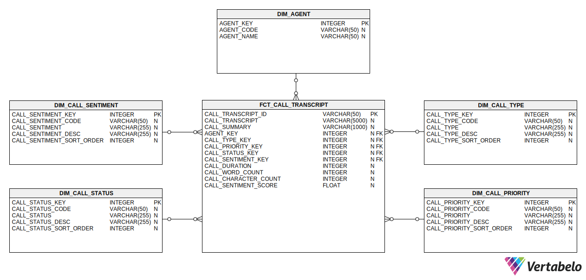


### Download Source Files

Download all source SQL files for this lab [here](https://download-directory.github.io/?url=https%3A%2F%2Fgithub.com%2Fdatalabsolutions%2FAI-Labs%2Ftree%2Fmain%2Fsnowflake-snowflake-intelligence-callcenter-lab%2Fscripts)

### Prerequisites

Duration: 0:01:00

* A [Snowflake account](https://trial.snowflake.com/?owner=SPN-PID-452710) in a region where **Snowflake Cortex LLM functions** are supported
* Basic familiarity with SQL and the Snowflake UI
* Access all the scripts for this Lab [on GitHub](https://github.com/datalabsolutions/AI-Labs/tree/main/snowflake-snowflake-intelligence-callcenter-lab)
* [Download all the audio files](https://github.com/datalabsolutions/AI-Labs/blob/a27daf7c5d6f72949cc73c820351348d755bbd9c/snowflake-snowflake-intelligence-callcenter-lab/assets/audio_files/audio-files.zip?raw=1)

> 💡 **Tip:** Explore this interactive walkthrough to learn how to sign up for a [Snowflake account](https://app.supademo.com/demo/cmbw9nmxe0606xw0izxyku479).

> 💡 **Tip:** Use the [LLM Function Availability](https://docs.snowflake.com/en/user-guide/snowflake-cortex/llm-functions#availability) page to check which cloud regions are supported.


## Configure Snowflake
Duration: 0:04:00

### Learning Outcome
Create the core Snowflake resources needed to run the AI Lab. This includes a database, warehouse, schemas, and a stage for uploading audio files.

### Download Script
Download the source code for this step [here](https://github.com/datalabsolutions/AI-Labs/blob/main/snowflake-snowflake-intelligence-callcenter-lab/scripts/01-AI-LAB-CONFIGURATION.sql).

### Description
This setup script prepares your Snowflake environment to ingest and process unstructured call center data.

* `CREATE DATABASE` ensures your lab operates in a clean, isolated environment.
* `CREATE WAREHOUSE` provisions compute resources for your queries and is configured to minimize cost via automatic suspend/resume.
* `CREATE SCHEMA` creates logical namespaces for raw files (`EXTRACT`), processed/intermediate data (`STAGE`), and data warehouse objects (`DWH`).
* `CREATE STAGE` sets up a secure location to upload audio and transcript documents (`.mp3`, `.json`), supports directory-style access, and uses Snowflake‑managed encryption.

### Step 1: Create the Database
This command creates a database named `CALL_CENTER_ANALYTICS_DW` if it doesn’t already exist. Using `IF NOT EXISTS` ensures the script is idempotent and safe to rerun.

```sql
CREATE DATABASE IF NOT EXISTS CALL_CENTER_ANALYTICS_DW;
```

### Step 2: Create Compute Warehouses
This step provisions two warehouses: `USER_STD_XSMALL_WH` for end users and `APP_STD_XSMALL_WH` for the Matillion service account. Separating workloads ensures there is no resource contention. Both warehouses are configured with cost-efficient settings:

* Size: `XSMALL` — small and cost‑effective for light workloads.
* Type: `STANDARD` — supports most use cases.
* Auto Suspend: `60` seconds — saves credits after inactivity.
* Auto Resume: `TRUE` — resumes automatically on query.
* Initially Suspended: `TRUE` — starts paused until needed.

```sql
CREATE OR REPLACE WAREHOUSE USER_STD_XSMALL_WH
WITH
    WAREHOUSE_SIZE = 'XSMALL'
    WAREHOUSE_TYPE = 'STANDARD'
    AUTO_SUSPEND = 60
    AUTO_RESUME = TRUE
    INITIALLY_SUSPENDED = TRUE;

CREATE OR REPLACE WAREHOUSE APP_STD_XSMALL_WH
WITH
    WAREHOUSE_SIZE = 'XSMALL'
    WAREHOUSE_TYPE = 'STANDARD'
    AUTO_SUSPEND = 60
    AUTO_RESUME = TRUE
    INITIALLY_SUSPENDED = TRUE;
```

> 💡 **Tip:** Auto-suspend after 60 seconds prevents unnecessary credit usage. Auto-resume ensures queries always run when needed.

### Step 3: Create Required Schemas

Schemas help organize your database objects.

```sql
CREATE SCHEMA IF NOT EXISTS CALL_CENTER_ANALYTICS_DW.EXTRACT;
CREATE SCHEMA IF NOT EXISTS CALL_CENTER_ANALYTICS_DW.STAGE;
CREATE SCHEMA IF NOT EXISTS CALL_CENTER_ANALYTICS_DW.DWH;
```

* `EXTRACT` stores the ingested audio and transcript files.
* `STAGE` is used for parsed, structured, or AI-enriched data.
* `DWH` is reserved for data warehouse objects, semantic views, aggregated results, and reporting tables.

Using `IF NOT EXISTS` prevents duplication errors and makes the script safe to rerun.

### Step 4: Create an Internal Stage for Uploads

The internal stage is where you will upload audio files. Also, create a file format for JSON to enable parsing of JSON documents.

```sql
CREATE OR REPLACE STAGE CALL_CENTER_ANALYTICS_DW.CALL_CENTER_DB.RAW.INT_STAGE_DOC
    DIRECTORY = ( ENABLE = true )
    ENCRYPTION = ( TYPE = 'SNOWFLAKE_SSE' );

CREATE OR REPLACE FILE FORMAT CALL_CENTER_ANALYTICS_DW.EXTRACT.JSON_FORMAT
  TYPE = JSON
  STRIP_OUTER_ARRAY = TRUE;
```
> 🔒 **Note:** Files uploaded here are secured with Snowflake’s Server-Side Encryption (SSE).

```sql
CREATE ROLE IF NOT EXISTS APP_MATILLION_ROLE;

-- Assign application role to SYSADMIN (best practice)
GRANT ROLE APP_MATILLION_ROLE TO ROLE SYSADMIN;

-- Create user
CREATE USER IF NOT EXISTS APP_MATILLION_SVC
  TYPE = LEGACY_SERVICE                           -- Explicitly mark as service account
  PASSWORD = 'M@tillion!1.'
  DEFAULT_ROLE = APP_MATILLION_ROLE
  DEFAULT_WAREHOUSE = APP_STD_XSMALL_WH
  MUST_CHANGE_PASSWORD = FALSE             -- Not required for service users
  COMMENT = 'Service account for Matillion ETL operations';

-- Assign role to user
GRANT ROLE APP_MATILLION_ROLE TO USER APP_MATILLION_SVC;

-- Database & schema usage
GRANT USAGE ON DATABASE CALL_CENTER_ANALYTICS_DW TO ROLE APP_MATILLION_ROLE;
GRANT USAGE ON ALL SCHEMAS IN DATABASE CALL_CENTER_ANALYTICS_DW TO ROLE APP_MATILLION_ROLE;

-- Warehouse usage
GRANT USAGE ON WAREHOUSE APP_STD_XSMALL_WH TO ROLE APP_MATILLION_ROLE;

-- Stage usage
GRANT READ ON STAGE CALL_CENTER_DB.RAW.INT_STAGE_DOC_RAW TO ROLE APP_MATILLION_ROLE;
GRANT WRITE ON STAGE CALL_CENTER_DB.RAW.INT_STAGE_DOC_RAW TO ROLE APP_MATILLION_ROLE;

-- Table privileges (all current + future tables)
GRANT SELECT, INSERT, UPDATE, DELETE ON ALL TABLES IN SCHEMA CALL_CENTER_ANALYTICS_DW.RAW TO ROLE APP_MATILLION_ROLE;
GRANT SELECT, INSERT, UPDATE, DELETE ON ALL TABLES IN SCHEMA CALL_CENTER_ANALYTICS_DW.STAGE TO ROLE APP_MATILLION_ROLE;
GRANT SELECT, INSERT, UPDATE, DELETE ON ALL TABLES IN SCHEMA CALL_CENTER_ANALYTICS_DW.ANALYTICS TO ROLE APP_MATILLION_ROLE;

GRANT SELECT, INSERT, UPDATE, DELETE ON FUTURE TABLES IN SCHEMA CALL_CENTER_ANALYTICS_DW.RAW TO ROLE APP_MATILLION_ROLE;
GRANT SELECT, INSERT, UPDATE, DELETE ON FUTURE TABLES IN SCHEMA CALL_CENTER_ANALYTICS_DW.STAGE TO ROLE APP_MATILLION_ROLE;
GRANT SELECT, INSERT, UPDATE, DELETE ON FUTURE TABLES IN SCHEMA CALL_CENTER_ANALYTICS_DW.ANALYTICS TO ROLE APP_MATILLION_ROLE;


```

### Step 6: Upload Files to the Stage

Your internal stage `CALL_CENTER_DB.RAW.INT_STAGE_DOC_RAW` is now set up.

1. In Snowsight, go to **Databases**.
2. Select `CALL_CENTER_ANALYTICS_DW` → `EXTRACT` → **Stages**.
3. Click on `INT_STAGE_DOC`.
4. Click **+ Files** and upload one or more audio recordings (.mp3), there are 50 files in total.
4. Click **+ Files** and upload the LOOKUP.json file (.json).

> 🔒 **Note:** The zip file that you [downloaded](https://github.com/datalabsolutions/AI-Labs/blob/a27daf7c5d6f72949cc73c820351348d755bbd9c/snowflake-snowflake-intelligence-callcenter-lab/assets/audio_files/audio-files.zip?raw=1) will need to be unzipped.  You need to upload the individual files.

---
## Configure Matillion

### Learning Outcomes
In this section, you will learn how to sign up for Matillion’s Data Productivity Cloud and connect Matillion to your Snowflake warehouse. You will also set up the necessary defaults for seamless data integration.

### Prerequisites
Before you begin, ensure you have:
- Access to a Snowflake account with privileges to create databases, warehouses, schemas, and stages.

### Description
In this section, you’ll create a Matillion account and configure your environment to work with call center data. You’ll learn how to register, set up your profile, select your region, choose your experience, and connect to your Snowflake warehouse. 

The trial is free and includes 500 usage credits, allowing you to explore Matillion’s features for building and managing ETL pipelines.

### Step 1: Create your account
- Go to [hub.matillion.com/register](https://hub.matillion.com/register)
- Choose a password and verify your email address
- Enter basic details like name, job title, and contact information


### Step 2: Choose Region
Select your preferred region carefully—this cannot be changed later.

> 💡 **Tip:** If your Snowflake account is in AWS Oregon, choose "US" as your region, the option on the left.

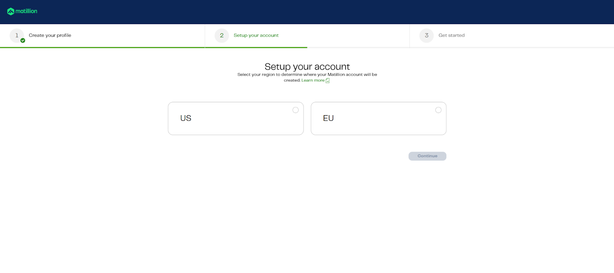

### Step 3: Choose your experience
Choose "Connect to your warehouse", the option on the right.

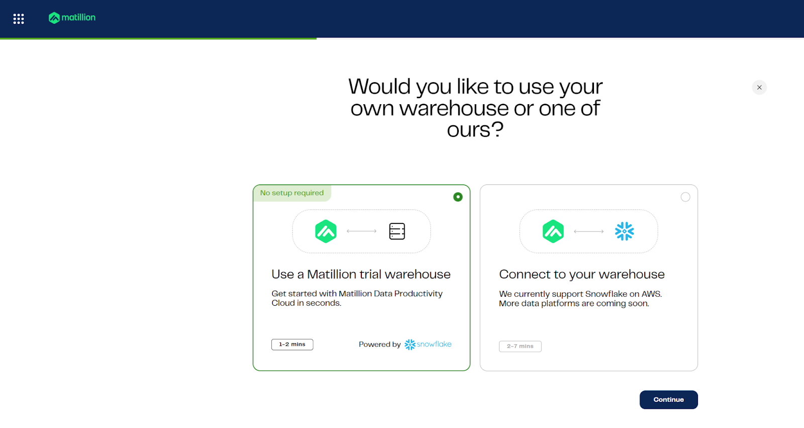

### Step 4: Find Your Snowflake Account Identifier

To locate your account identifier in Snowflake:

- Open Snowsight.
- In the bottom left corner, click your username.
- Select **"Connect a tool to Snowflake"**.
- Copy the **Account Identifier** shown—this is needed to connect Matillion to your Snowflake environment.

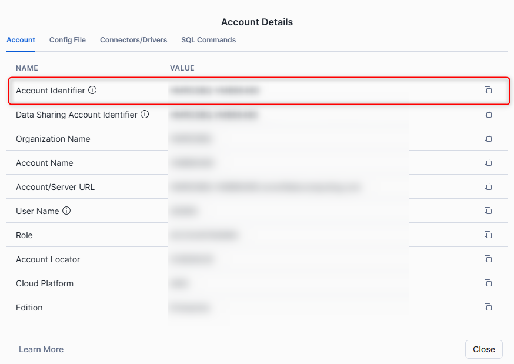

### Step 5: Specify credentials
Provide account, username, and password for your warehouse

Use the following values (unless you changed the password)

| **Attribute** | **Value**            |
|---------------|----------------------|
| **Account**   | XXXXXX-XXXXXXX       |
| **Username**  | APP_MATILLION_SVC    |
| **Password**  | M@tillion!1.         |

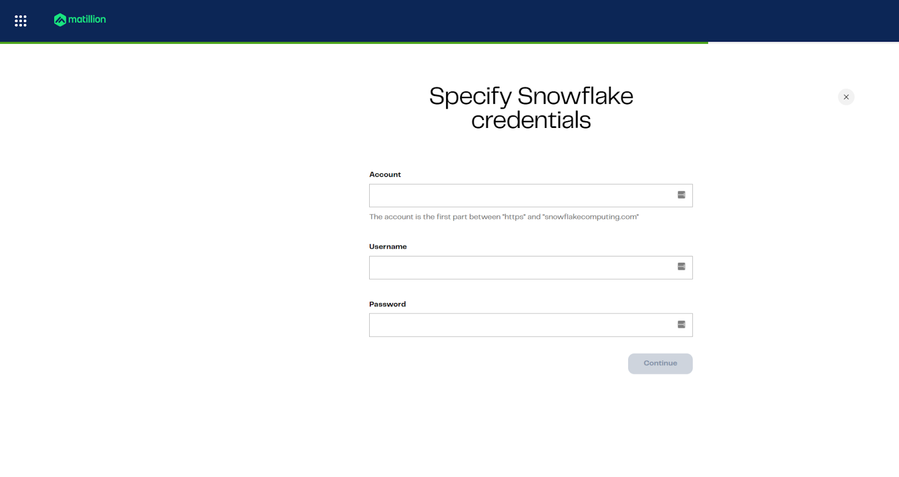

### Step 6: Specify database defaults
Set role, warehouse, database, and schema defaults for pipelines


| **Attribute**         | **Value**                 |
|-----------------------|---------------------------|
| **Default role**      | APP_MATILLION_ROLE        |
| **Default warehouse** | APP_STD_XSMALL_WH         |
| **Default database**  | CALL_CENTER_ANALYTICS_DW  |
| **Default schema**    | EXTRACT                   |

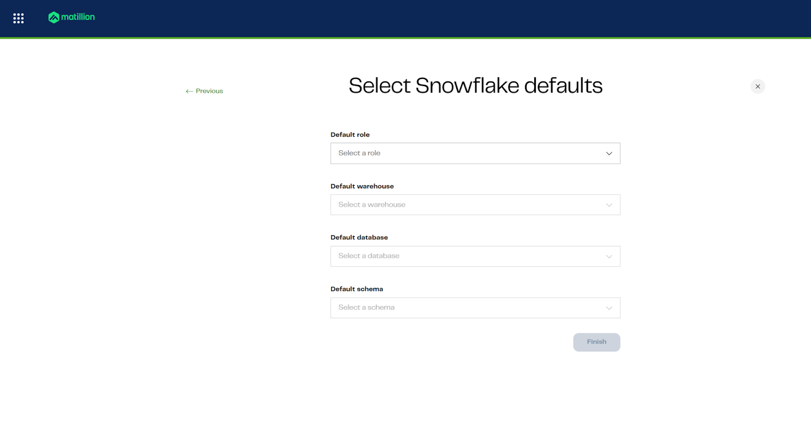

You’re now ready to begin building pipelines with Matillion and Maia.

## Configure Project & Deploy Schema


### Learning Outcomes

### Prerequisites

### Description


## Extract ETL

### Learning Outcomes

By completing this section, you will:

- Understand how to load and store binary data into snowflake table.
- Understand how to load and flatten JSON data.
- Prepare raw call center data for downstream AI enrichment and analytics.

### Prerequisites

- Completion of Snowflake environment setup, including creation of stages and file formats.
- Access to Matillion Data Productivity Cloud with a connected Snowflake account.
- Audio files and lookup JSON uploaded to the Snowflake stage.

### Description

In this section, you will create two Matillion Maia extract pipelines. The first pipeline loads new or updated audio files (`.mp3`) from a Snowflake stage into the `EXTRACT.AUDIO_FILES` table, ensuring incremental extraction and proper filtering. The second pipeline extracts lookup data from a JSON file, loading it into the `EXTRACT.LOOKUP` table for use in later transformation and enrichment steps. These pipelines form the foundation for processing and analyzing call center data.

### Step 1: Create EXTRACT_AUDIO_TRANSCRIPT

#### Pipeline
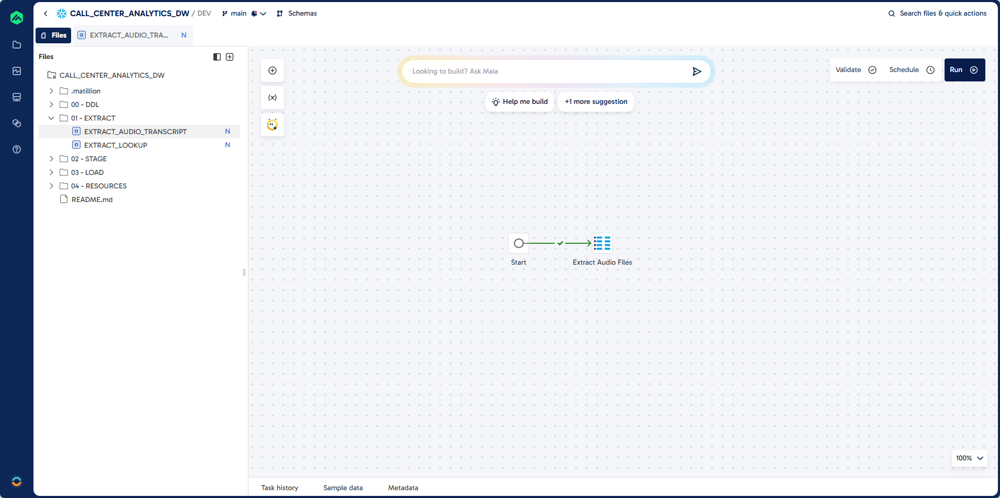

#### Prompt

```plaintext
Task: Create a pipeline to do incremental extract of audio files (.MP3) stored in a snowflake stage.

Job Name: EXTRACT_AUDIO_TRANSCRIPT
Folder: 01 - EXTRACT

Source: @EXTRACT.INT_STAGE_DOC
Target: EXTRACT.AUDIO_FILES (existing table)
Unique Identifier: CALL_TRANSCRIPT_ID
Load Type: Incremental - exclude existing records

Guidelines: 
Filter: RELATIVE_PATH LIKE .mp3

Output Fields:
CALL_TRANSCRIPT_ID
FILE_PATH
AUDIO_FILE
AUDIO_FILE_URL
LAST_MODIFIED 
FILE_SIZE
LAST_MODIFIED
FILE_EXTENSION
```

### Step 2: Create EXTRACT_LOOKUP

#### Pipeline
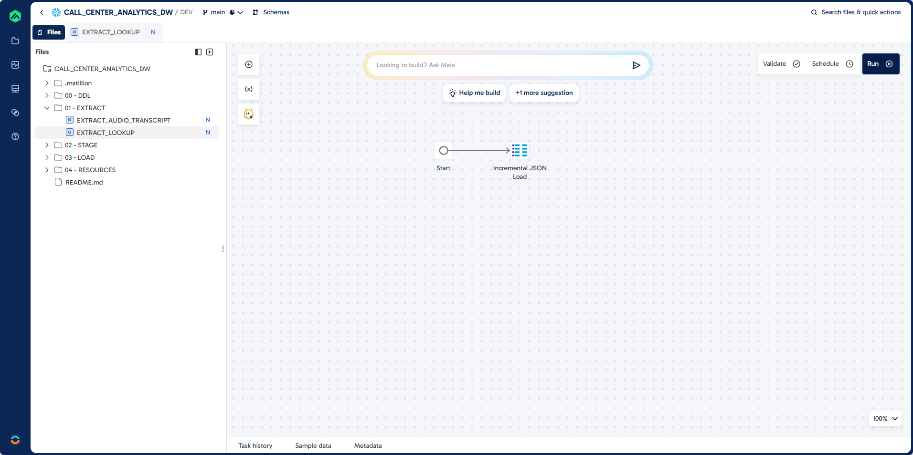

#### Prompt
```plaintext
Task: Create a pipeline to do incremental extract of json file stored in a snowflake stage.

Job Name: EXTRACT_LOOKUP
Folder: 01 - EXTRACT

Source: @EXTRACT.INT_STAGE_DOC
Target: EXTRACT.LOOKUP (existing table)
File: LOOKUP.json
File Format: EXTRACT.JSON_FORMAT
Unique Identifier: LOOKUP_FILTER, LOOKUP_ID  
Load Type: Incremental - exclude existing records
```

## Stage ETL

### Learning Outcomes

By completing this section, you will:

- Build a step-by-step transformation pipeline in Matillion Maia to analyze call center audio data using Snowflake Cortex AI functions.
- Use the following Snowflake Cortex AI functions in your pipeline:
  - `AI_TRANSCRIBE`: Convert raw audio files into searchable transcripts and extract metadata.
  - `EXTRACT_ANSWER`: Extract the agent name from transcripts.
  - `SUMMARISE`: Generate concise call summaries.
  - `AI_SENTIMENT`: Classify overall call sentiment.
  - `COMPLETE`: Extract multiple attributes such as call type, resolution status, priority, and sentiment score.
- Use the `REGEX` function to derive agent initals from agent names.
- Use CALCULATOR components to extract values from JSON AI responses.
- Implement incremental load logic to process only new or updated records, maintaining an efficient and up-to-date data warehouse.
- Understand how each AI function enriches your call center analytics for actionable business insights.

### Prerequisites

- Completion of Snowflake configuration steps in this lab.
- Access to Matillion Data Productivity Cloud with a connected Snowflake account.
- Sufficient roles and privileges to create and manage schemas and projects.
- Extracted `.mp3` audio files loaded into the `EXTRACT.AUDIO_FILES` table.


### Step 1: Create STAGE_AUDIO_TRANSCRIPT

In this step, you will build a Matillion Maia transformation pipeline to ingest and transcribe call center audio files. The pipeline reads `.mp3` files from the source table, applies the Snowflake Cortex `AI_TRANSCRIBE` function to convert audio into text, and extracts key metadata such as duration, transcript content, and word/character counts. The job is designed for incremental loading, ensuring only new or updated audio files are processed and added to the target table. This forms the foundation for downstream analytics and enrichment.

#### Pipeline

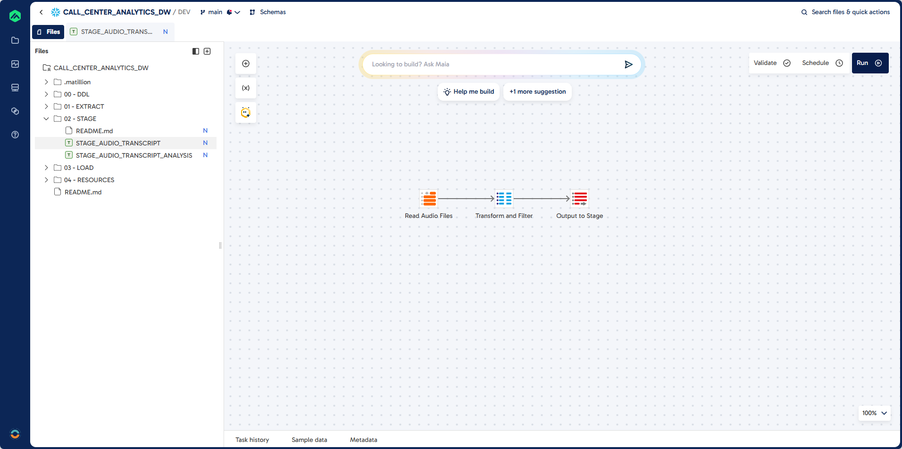

#### Prompt

```plaintext
Task: Create a job to do incremental load of audio transcription:

Job Name: STAGE_AUDIO_TRANSCRIPT
Job Type: Transformation
Folder: 02 - STAGE

Source: EXTRACT.AUDIO_FILES  
Target: STAGE.AUDIO_TRANSCRIPT (existing table)  
Unique Identifier: TRANSCRIPT_ID (unique identifier)  
Load Type: Incremental - exclude existing records

Guidelines: Use AI_TRANSCRIBE function to convert audio files to JSON extract the audio_duration and text attributes.

Required Output Fields:
TRANSCRIPT_ID 
FILE_PATH
AUDIO_FILE_URL
FILE_SIZE
LAST_MODIFIED
TRANSCRIPT_JSON
DURATION
TRANSCRIPT
TRANSCRIPTION_DATE
CHARACTER_COUNT
WORD_COUNT
```

### Step 2: Create STAGE_AUDIO_TRANSCRIPT_ANALYSIS
In this section, you will build a comprehensive transformation pipeline to analyze call center transcripts using Snowflake Cortex AI functions. 

#### Pipeline

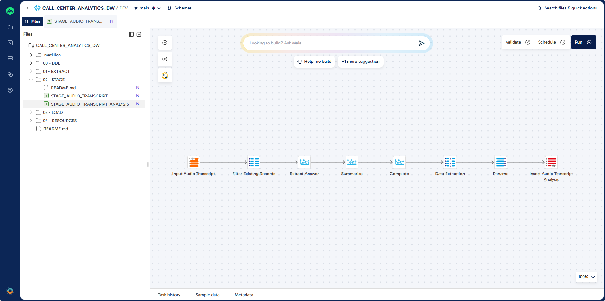

#### Prompt: Job

Each step below describes the transformation logic and the corresponding pipeline component.

First, you will create a blank transformation pipeline to serve as the foundation for subsequent steps.

```plaintext
Task: To create a complex data transformation pipeline step by step.
First create a blank transformation pipeline.

Job Name: STAGE_AUDIO_TRANSCRIPT_ANALYSIS
Folder: 02 - STAGE
```

#### Prompt: Table Input

Next, you will connect to the source table containing transcribed audio data. This step uses a Table Input component to read the necessary columns from the `STAGE.AUDIO_TRANSCRIPT` table.


```plaintext
Task: Create a connection to source table

Component: Table Input
Component Name: Input Audio Transcript

Source: STAGE.AUDIO_TRANSCRIPT
Columns:
CALL_TRANSCRIPT_ID
TRANSCRIPTION_DATE
AUDIO_FILE_URL
TRANSCRIPT
DURATION
CHARACTER_COUNT
WORD_COUNT
```
#### Prompt: Extract Answer

You will then extract the call center agent's name from each transcript using the Cortex Extract Answer component. This step applies an AI prompt to identify and return the agent's name.

```plaintext
Task: Extract the call centre agent name from the transcript.
Component: Cortex Extract Answer
Component Name: Extract Answer
Column: AGENT_NAME_AI
Question: What is the name of the caller centre agent?
```

#### Prompt: Summarise

After extracting the agent name, you will summarize the transcript using the Cortex Summarise component. This provides a concise overview of each call.

```plaintext
Task: Summarise the call centre transcript
Component: Cortex Summarise
Component Name: Summarise
```

#### Prompt: Sentiment

Next, you will classify the overall sentiment of the call using the Cortex Sentiment component. This step adds a sentiment score or label to each transcript.

```plaintext
Task: Add a sentiment classification
Component: Cortex Sentiment
Component Name: Sentiment
```

#### Prompt: Complete

You will then extract multiple key attributes from the transcript using the Cortex Multi-Prompt component. This step categorizes the call type, resolution status, priority, and calculates a sentiment score based on AI-driven prompts.

```plaintext
Task: Extract the following information from the call centre transcript.
Component: Cortex Multi-Prompt
Component Name: Complete

--------------------------------------------------
Column: CALL_TYPE_CODE
Prompt: Categorise the call into one of the following?

BILLING:Billing enquiry. Questions about charges, payments, or invoices.
TECHNICAL_SUPPORT: Technical support. Help resolving technical issues or access problems.
COMPLAINT: Complaint. Customer expresses dissatisfaction or reports a problem.
INFORMATION: Information request. Caller asks for information or clarification.
SALES: Sales/upgrade. Interest in buying or upgrading a product or service.
CANCELLATION: Cancellation. Caller wants to cancel a subscription or service.
OTHER: Other. Does not fit known categories; requires manual review or enrichment.

You must return ONE of the codes: BILLING, TECHNICAL_SUPPORT, COMPLAINT, INFORMATION, SALES, CANCELLATION, OTHER

--------------------------------------------------
Column: CALL_STATUS_CODE
Prompt: Has the call be resolved?

YES: Issue resolved. Problem fully addressed during the interaction.
PARTIAL: Partially resolved. Follow-ups or actions still required.
NO: Not resolved. Issue unresolved; escalation likely.

You must return ONE of the codes: YES, PARTIAL, NO

--------------------------------------------------
Column: CALL_PRIORITY_CODE
Prompt: What is the priority of this call?

LOW: Items that can be solved within 3 days.
MEDIUM: Target resolution within 24-72 hours.
HIGH: Requires action within 24 hours.
CRITICAL: Immediate action required; severe impact likely.

--------------------------------------------------
You must return ONE of the codes: LOW, MEDIUM, HIGH, CRITICAL

Column: CALL_SENTIMENT_SCORE
Prompt: Calculate a Call Sentiment Score between -1 and 1?

```

#### Prompt: Calculator

After extracting and transforming the necessary attributes from the transcripts, you will use a Calculator component to further process and standardize the data. This step ensures that key fields are properly formatted and derived for downstream analytics.

```plaintext
Component: Calculator
Component Name: Data Extraction

Task: Extract the answer from the AGENT_NAME_AI json and upper case.
Column: AGENT_NAME

Task: Extract the sentiment from the sentiment_TRANSCRIPT json and upper case.
Column: CALL_SENTIMENT_CODE

Task: What are the initials of the caller centre agent, combined using REGEX and upper case?
Column: AGENT_CODE
```

#### Prompt: Rename
Next, review the pipeline to confirm that all required columns are present and correctly named. Use the Rename component to standardize column names and prepare the data for loading into the target table.

```plaintext
Task: Review the pipeline and ensure you have all the columns.
Component: Rename
Component Name: Rename
Columns:
CALL_TRANSCRIPT_ID
CALL_SUMMARY
CALL_TRANSCRIPT
CALL_DATE
AGENT_CODE
AGENT_NAME
CALL_TYPE_CODE
CALL_SENTIMENT_CODE
CALL_PRIORITY_CODE
CALL_STATUS_CODE
CALL_DURATION
CALL_CHARACTER_COUNT
CALL_WORD_COUNT
CALL_SENTIMENT_SCORE

Task: Insert into STAGE.AUDIO_TRANSCRIPT_ANALYSIS.
Component: Table Output
Component Name: Insert Audio Transcript Analysis
```

#### Prompt: Filter

To prevent duplicate processing, add a filter to exclude records that have already been loaded. Insert a SQL component between the Input Audio Transcript and Extract Answer steps to implement this logic.

```plaintext
Task: Add Filter to exclude existing records that have already been loaded
Component: SQL
Component Name: Filter Existing Records
Guidelines: Add this between Input Audio Transcript and Extract Answer
```

## Load ETL

### Learning Outcomes

By completing this section, you will:

- Understand how to design and implement a star schema data warehouse for call center analytics.
- Build transformation pipelines to incrementally load dimension and fact tables using Matillion Maia.
- Apply best practices for data cleansing, deduplication, and surrogate key management.
- Integrate AI-enriched call transcript data with structured warehouse tables for advanced reporting.

### Prerequisites

Completion of previous lab steps, including extraction and staging of call center audio and transcript data.

### Description

In this section, you will construct a robust data warehouse to support call center analytics. You will create transformation pipelines to load dimension tables (agents, call priority, sentiment, status, and type) and a fact table for call transcripts. Each pipeline ensures incremental loading by filtering out existing records and standardizing data formats. You will also build a parent orchestration job to automate the full data warehouse refresh, enabling seamless integration of AI-driven insights with traditional reporting structures.

### Step 1: Create LOAD_DIM_AGENT

In this step, you will build a transformation pipeline to load unique agent records into the `DIM_AGENT` dimension table. This process extracts distinct agent codes and names from the analyzed transcripts, ensures all data is upper case, and filters out records that already exist in the destination table for incremental loading.

#### Pipeline

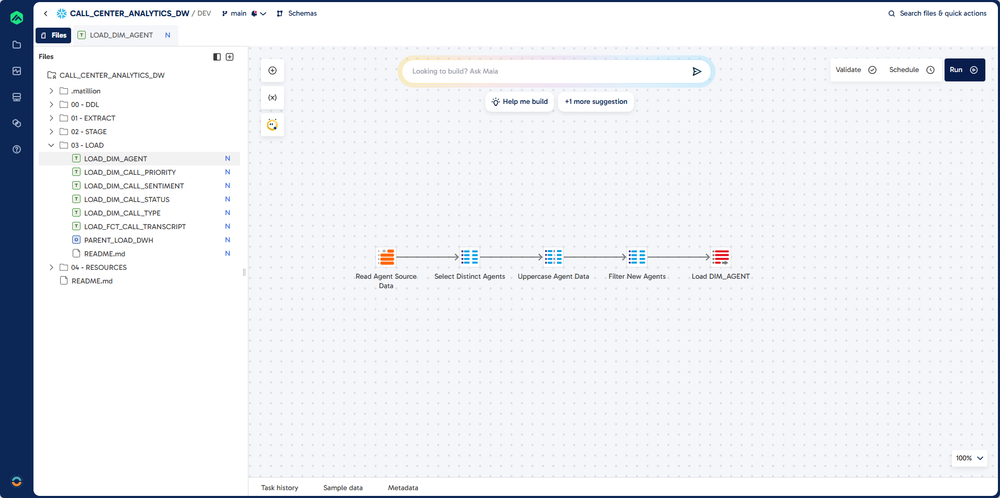

#### Prompt

```plaintext
Task: Load unique agent records into DIM_AGENT
Job Name: LOAD_DIM_AGENT
Job Type: Transformation
Folder: 03 - LOAD

Source: STAGE.AUDIO_TRANSCRIPT_ANALYSIS
Target: DWH.DIM_AGENT (existing table)
Unique Identifier: AGENT_CODE
Load Type: Incremental Load
Component: Table Input, SQL, Calculator, Table Ouput

Guidelines:
Use distinct AGENCT_CODE and AGENT_NAME
Ensure all columns are upper case
Filter Existing Records
```

### Step 2: Create LOAD_DIM_CALL_PRIORITY

This section guides you through building a pipeline to populate the `DIM_CALL_PRIORITY` dimension table. You will filter lookup records for call priority, transform columns to upper case, and insert only new records into the destination table.

#### Pipeline


#### Prompt

```plaintext
Task: Create Dimension Load for DIM_CALL_PRIORITY

Job Name: LOAD_DIM_CALL_PRIORITY
Job Type: Transformation
Folder: 03 - LOAD

Source: EXTRACT.LOOKUP  
Filter: LOOKUP_FILTER = "CALL_PRIORITY"
Target: DWH.DIM_CALL_PRIORITY (existing table)  
Unique Identifier: CALL_PRIORITY_CODE
Load Type: Incremental Load

Guidelines:
Component: Calculator
Ensure all columns are upper case

Component: SQL
Filter for records that do not exist in destination

Component: Table Ouput
Insert records into destination

```  

### Step 3: Create LOAD_DIM_CALL_SENTIMENT

Here, you will create a pipeline to load sentiment dimension data into `DIM_CALL_SENTIMENT`. The process filters for sentiment lookups, transforms columns to upper case, and loads only new records.

#### Pipeline
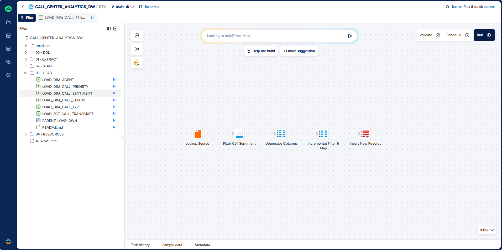

#### Prompt

```plaintext
Task: Create Dimension Load for DIM_CALL_SENTIMENT 

Job Name: LOAD_DIM_CALL_SENTIMENT
Folder: 03 - LOAD

Source: EXTRACT.LOOKUP  
Filter: LOOKUP_FILTER = "CALL_SENTIMENT"
Target: DWH.DIM_CALL_SENTIMENT (existing table)  
Unique Identifier: CALL_SENTIMENT_CODE
Load Type: Incremental Load

Guidelines:
Component: Calculator
Ensure all columns are upper case

Component: SQL
Filter for records that do not exist in destination

Component: Table Ouput
Insert records into destination
```

### Step 4: Create LOAD_DIM_CALL_STATUS

This step walks you through building a pipeline to load call status dimension data into `DIM_CALL_STATUS`. You will filter for call status lookups, ensure all columns are upper case, and exclude existing records for incremental loading.

#### Pipeline
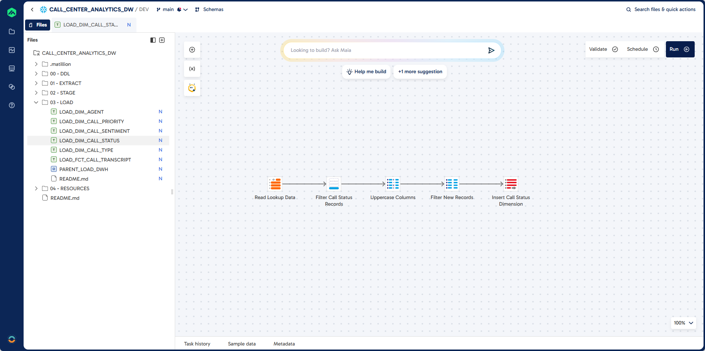

#### Prompt
```plaintext
Task: Create Dimension Load for DIM_CALL_STATUS

Job Name: LOAD_DIM_CALL_STATUS
Folder: 03 - LOAD

Source: EXTRACT.LOOKUP  
Filter: LOOKUP_FILTER = "CALL_STATUS"
Target: DWH.DIM_CALL_STATUS (existing table)  
Unique Identifier: CALL_STATUS_CODE
Load Type: Incremental Load
Component: Table Input, SQL, Calculator, Table Ouput

Guidelines:
Ensure all columns are upper case
Filter Existing Records
```

### Step 5: Create LOAD_DIM_CALL_TYPE

In this section, you will build a pipeline to load call type dimension data into `DIM_CALL_TYPE`. The process filters for call type lookups, transforms columns to upper case, and loads only new records.

#### Pipeline


#### Prompt
```plaintext
Task: Create Dimension Load for DIM_CALL_TYPE

Job Name: LOAD_DIM_CALL_TYPE
Folder: 03 - LOAD

Source: EXTRACT.LOOKUP  
Filter: LOOKUP_FILTER = "CALL_TYPE"
Target: DWH.DIM_CALL_TYPE (existing table)  
Unique Identifier: CALL_TYPE_CODE
Load Type: Incremental Load

Guidelines:
Component: Calculator
Ensure all columns are upper case

Component: SQL
Filter for records that do not exist in destination

Component: Table Ouput
Insert records into destination

```

### Step 6: Create LOAD_FCT_CALL_TRANSCRIPT

This step covers building a pipeline to load fact data into `FCT_CALL_TRANSCRIPT`. You will join the analyzed transcripts with all dimension tables using lookups, handle incremental loads, and validate records before insertion.

#### Pipeline
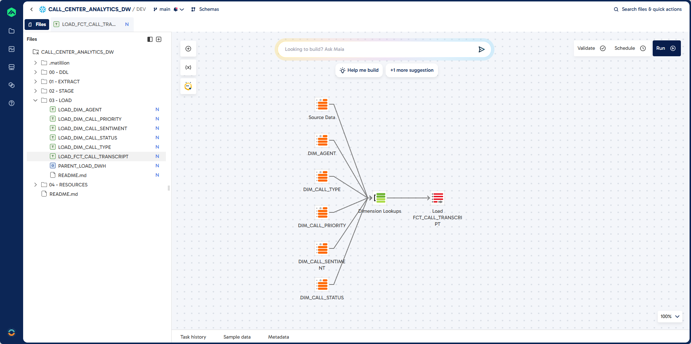

#### Prompt
```plaintext
Task: Create Load Process for FCT_CALL_TRANSCRIPT
Job Name: LOAD_FCT_CALL_TRANSCRIPT
Job Type: Transformation
Folder: 03 - LOAD

Source: STAGE.AUDIO_TRANSCRIPT_ANALYSIS
Target: DWH.FCT_CALL_TRANSCRIPT (existing table)

Unique Identifier: CALL_TRANSCRIPT_ID (unique identifier)
Load Type: Incremental Load
Validation Errors: If there are validation errors let me check manually

Dimension Lookup: 
DWH.DIM_AGENT
DWH.DIM_CALL_PRIORITY
DWH.DIM_CALL_SENTIMENT
DWH.DIM_CALL_STATUS
DWH.DIM_CALL_TYPE

Guidelines: 
Create lookups for the dimensions that include the natural keys and surrogate keys.
Join these to the results from the audio transcript table.
```

### Step 7: Create PARENT_LOAD_DWH

Finally, you will create a parent orchestration job to automate the full data warehouse load process. This job truncates all dimension and fact tables, then runs all dimension and fact load jobs in sequence.

#### Pipeline
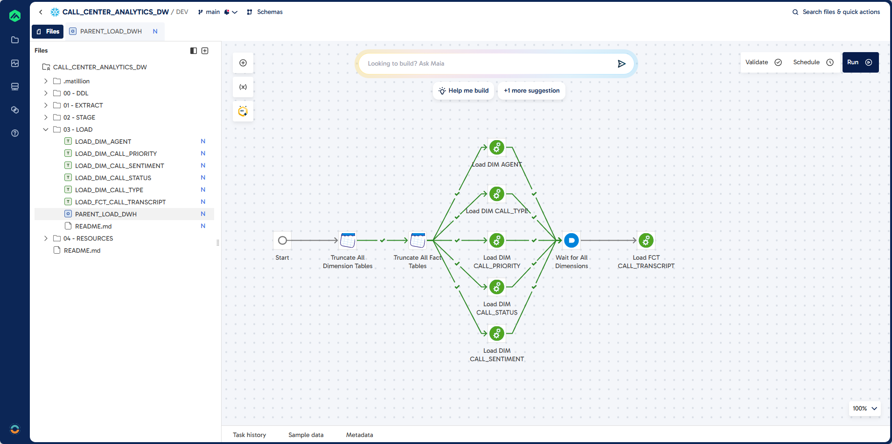

#### Prompt
```plaintext
Task: Create a Parent Orchestration Job. 
Job Name: PARENT_LOAD_DWH
Job Type: Orchastration
Folder: 03 - LOAD 

Guidelines:
Use DWH Schema
First truncate all the dimensions (tables prefixed with DIM_) 
Then truncate all the fact tables (tables prefixed with FCT_) 

Then run all the load dimension jobs (Jobs starting with LOAD_DIM_)
Then run all the load fact jobs (Jobs starting with LOAD_FCT_)

The load jobs are in the folder: 03 - Load
```
